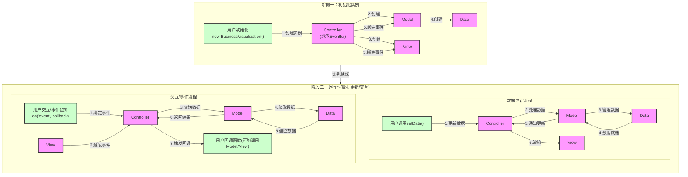
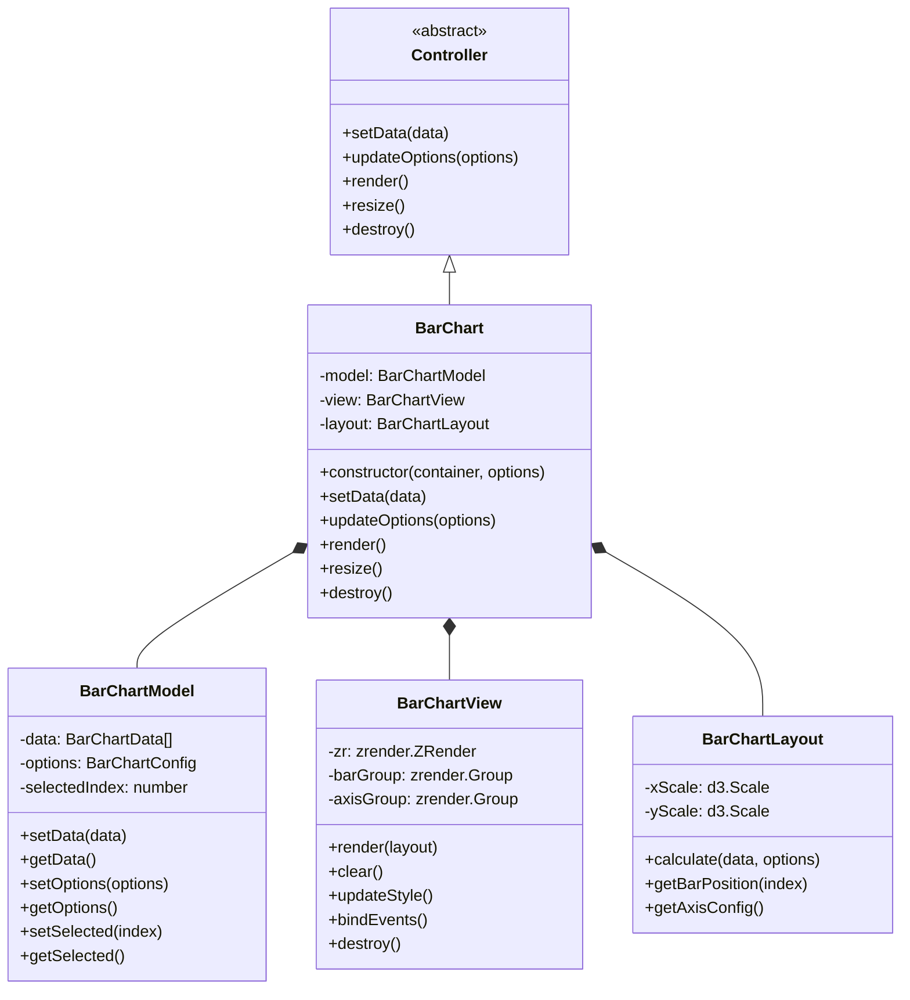

# 业务可视化组件设计文档

> Please DON'T remove notes for AI


> Notes for AI: 以下是框架的项目架构基调
> 根据实际业务设计相关层的业务逻辑实现。可适当调整核心基类， 但必须**非常非常**谨慎思考。

## 1. 项目架构

### 1.1 整体架构
项目采用基于 D3+ ZRender + TypeScript 的组件化架构，基于业务可视化的特点，主要分为以下几个核心模块：

- 主流程模块：负责整体流程控制
- 数据处理模块：负责配置项和业务数据的处理
- 渲染模块：负责调用底层渲染引擎API
- 事件模块：与图表实例对象绑定的事件系统

### 1.2 文件结构
```
components/
├── base/                      # 基础框架核心
│   ├── core/                 # 核心基类
│   │   ├── Eventful.ts     # 事件基类
│   │   ├── Controller.ts    # 控制器类(继承Eventful)
│   │   ├── Model.ts        # 模型类
│   │   ├── View.ts         # 视图类
│   │   └── Data.ts         # 数据处理类
│   │
│   ├── model/                # 模型层业务逻辑实现
│   │
│   ├── view/                # 视图层业务逻辑实现
│   ├── layout/        # 布局计算
│   └── theme/         # 主题系统(可选)
│   │
│   ├── controller/          # 控制器层业务逻辑实现
│   ├── helper/             # 业务相关辅助工具
│   │   ├── functions/     # 辅助函数(可选)
│   │   └── classes/       # 辅助类(可选)
│   │
│   ├── types/              # TypeScript 类型定义
│   │   ├── core.ts        # 核心类型
│   │   ├── model.ts       # 模型相关类型
│   │   ├── view.ts        # 视图相关类型
│   │   └── controller.ts  # 控制器相关类型
│   │
│   └── utils/              # 工具函数
│       ├── math.ts        # 数学计算
│       ├── common.ts      # 通用的工具函数(如isFunction, deepMerge等)
│       └── format.ts      # 格式化工具
│
└── index.ts                # 框架入口文件
```

核心设计说明：
1. **核心基类 (core/)**: 
   - `Eventful`: 提供事件机制的基础类，是整个框架的事件基础
   - `Controller`: 继承自Eventful，作为框架的核心调度者，负责协调其他模块
   - `Model`: 持有Data实例，负责业务数据处理和业务逻辑
   - `View`: 负责视图渲染和用户交互
   - `Data`: 作为Model的内部类，负责数据的存储、处理和管理

2. **业务逻辑实现**:
   - `model/`: 实现具体的业务数据处理逻辑
   - `view/`: 实现具体的视图渲染逻辑
   - `controller/`: 实现具体的业务控制逻辑
   - `layout/`: 实现布局计算逻辑
   - `theme/`: 可选的主题系统实现

3. **辅助工具**:
   - `helper/`: 存放业务相关的辅助工具(可选)
   - `utils/`: 存放通用工具函数，如数学计算、通用函数等
   - `types/`: TypeScript类型定义，确保类型安全

4. **模块职责**:
   - Controller作为核心调度者，负责协调Model和View
   - Model通过内部的Data实例来管理数据
   - View负责渲染和用户交互
   - 各模块通过Controller中继的事件机制通信

5. **设计原则**:
   - 核心基类提供基础能力
   - 业务逻辑在对应目录中实现
   - 通过事件机制实现模块间通信
   - 保持模块间的低耦合度

### 1.3 技术栈选型
- 开发语言：TypeScript
- 构建工具：Rollup
- 可视化计算/布局构件: D3
- 可视化渲染引擎: ZRender或D3
- 包管理器：npm

## 2. 程序流程

> Notes for AI: 以下是框架整体的程序流程基调
> 根据实际业务设计业务逻辑相关模块的内部程序流程。可以调整非业务部分的程序流程，但必须**非常非常**谨慎思考。

### 2.0 整体流程图


### 2.1 初始化阶段
1. **实例创建**
   - 用户创建BusinessVisualization实例
   - Controller实例化
   - Model实例化及其Data实例创建
   - View实例化

2. **事件系统初始化**
   - Controller继承Eventful获得事件能力
   - Controller与Model绑定事件
   - Controller与View绑定事件
   - 事件系统就绪

3. **初始化配置**
   - 配置项校验
   - 默认配置合并
   - 主题初始化(可选)
   - 布局配置初始化

### 2.2 运行时阶段
1. **数据更新流程**
   - 用户调用setData()触发数据更新
   - Controller接收数据并转发给Model
   - Model通过Data进行数据处理
     * 数据格式校验
     * 数据结构转换
     * 数据计算和聚合
   - Data完成处理返回给Model
   - Model通知Controller数据就绪
   - Controller调用View进行渲染

2. **交互事件流程**
   - 用户绑定事件监听(on方法)
   - View触发用户交互事件
   - Controller接收View事件
   - Controller请求Model获取相关数据
   - Model从Data获取数据
   - Controller执行用户回调
   - 用户回调可能触发新的数据更新或视图更新

3. **更新机制**
   - 数据驱动的更新
     * Model数据变更触发更新
     * 批量更新优化
     * 异步更新队列
   - 交互驱动的更新
     * 用户交互触发更新
     * 事件节流和防抖
     * 局部更新优化

4. **资源管理**
   - 数据缓存管理
   - 事件监听管理
   - 内存资源管理
   - 实例销毁处理

## 3. 模块规划

### 3.1 核心模块 (core/)
1. **Eventful**
   - 事件注册机制
   - 事件触发机制
   - 事件解绑机制
   - 事件命名空间管理

2. **Controller**
   - 继承Eventful的事件能力
   - 模块实例管理
   - 事件调度和分发
   - 模块间通信控制
   - 生命周期管理

3. **Model**
   - Data实例管理
   - 业务数据处理
   - 数据状态管理
   - 与Controller通信

4. **View**
   - 渲染引擎管理
   - 视图更新控制
   - 交互事件触发
   - 与Controller通信

5. **Data**
   - 数据存储管理
   - 数据处理转换
   - 数据缓存控制
   - 与Model通信

> Notes for AI: 业务实现层是每次应用框架时设计的重点
> 着重设计业务实现层，以及连带的功能模块、辅助工具
> 着重设计数据管理部分和对外API部分，这决定整个业务板块的核心

### 3.2 业务实现层
1. **模型层实现 (model/)**
   - 具体业务数据处理逻辑
   - 业务规则实现
   - 数据转换规则
   - 数据验证规则

2. **视图层实现 (view/)**
   - 具体视图渲染逻辑
   - 视图组件实现
   - 交互行为实现
   - 动画效果实现

3. **控制层实现 (controller/)**
   - 具体业务流程控制
   - 业务事件处理
   - 状态迁移控制
   - 异常处理机制

### 3.3 功能模块
1. **布局模块 (layout/)**
   - 布局计算引擎
   - 布局策略实现
   - 自适应处理
   - 布局缓存管理

2. **主题模块 (theme/)**(可选)
   - 主题定义和管理
   - 样式规则处理
   - 主题切换机制
   - 样式计算缓存

### 3.4 辅助工具
1. **业务辅助 (helper/)**
   - 业务相关工具函数
   - 业务相关工具类
   - 可选功能扩展
   - 业务常量定义

2. **通用工具 (utils/)**
   - 数学计算工具
   - 通用工具函数
   - 格式化工具
   - 类型判断工具

### 3.5 类型系统 (types/)
1. **核心类型**
   - 基础接口定义
   - 类型别名定义
   - 枚举类型定义

2. **业务类型**
   - 模型相关类型
   - 视图相关类型
   - 控制器相关类型
   - 配置项类型

## 4. 渲染及更新机制

### 4.1 渲染机制
- 渲染引擎API调用策略
- 分层渲染控制
- 按需渲染优化
- 重绘策略优化

### 4.2 更新机制
- 数据驱动更新
- 异步更新队列
- 批量更新优化
- 局部更新策略


## 5. 数据管理

### 5.1 数据结构设计
- 配置项数据结构
- 业务数据结构
- 渲染数据结构
- 缓存数据结构

### 5.2 数据处理流程
- 数据预处理
- 数据转换
- 数据计算
- 数据缓存

## 6. 对外API输出管理

### 6.1 实例API设计
- 图表行为触发方法

### 6.2 实例初始化及更新方法
- 图表实例初始化方法
- 图表数据更新方法

# 柱状图组件技术方案设计

## 1. 组件架构设计

### 1.1 目录结构
```
components/
└── bar/
    ├── BarChart.ts              # 柱状图控制器
    ├── BarChartModel.ts         # 数据模型
    ├── BarChartView.ts          # 视图渲染
    ├── BarChartLayout.ts        # 布局计算
    ├── types/                   # 类型定义
    │   ├── config.ts           # 配置项类型
    │   ├── data.ts            # 数据类型
    │   └── event.ts           # 事件类型
    └── utils/                   # 工具函数
        ├── scale.ts           # 比例尺工具
        ├── animation.ts       # 动画工具
        └── style.ts          # 样式工具
```

### 1.2 类图设计


## 2. 模块设计

### 2.1 BarChart（控制器）
```typescript
export class BarChart extends Controller {
    private model: BarChartModel;
    private view: BarChartView;
    private layout: BarChartLayout;

    constructor(container: HTMLElement, options?: BarChartConfig) {
        super(container, options);
    }

    protected createModules(): void {
        this.model = new BarChartModel(this.options);
        this.view = new BarChartView(this.container, this.options);
        this.layout = new BarChartLayout();
    }

    protected bindInternalEvents(): void {
        // 绑定内部事件
        this.view.on('barClick', this.handleBarClick);
        this.view.on('barHover', this.handleBarHover);
        this.model.on('dataChanged', this.handleDataChange);
    }

    public setData(data: BarChartData[]): void {
        this.model.setData(data);
        this.render();
    }

    public render(): void {
        const layout = this.layout.calculate(
            this.model.getData(),
            this.model.getOptions()
        );
        this.view.render(layout);
    }
}
```

### 2.2 BarChartModel（数据模型）
```typescript
export class BarChartModel extends Eventful {
    private data: BarChartData[] = [];
    private options: BarChartConfig;
    private selectedIndex: number | null = null;

    constructor(options: BarChartConfig) {
        super();
        this.options = this.validateOptions(options);
    }

    public setData(data: BarChartData[]): void {
        this.data = this.validateData(data);
        this.emit('dataChanged', this.data);
    }

    private validateData(data: BarChartData[]): BarChartData[] {
        return data.map((item, index) => ({
            name: item.name || `Item ${index}`,
            value: Number(item.value) || 0,
            id: item.id || index,
            color: item.color
        }));
    }

    public setSelected(index: number | null): void {
        if (this.selectedIndex !== index) {
            this.selectedIndex = index;
            this.emit('selectionChanged', index);
        }
    }
}
```

### 2.3 BarChartView（视图渲染）
```typescript
export class BarChartView extends Eventful {
    private zr: zrender.ZRender;
    private barGroup: zrender.Group;
    private axisGroup: zrender.Group;
    private bars: zrender.Rect[] = [];

    constructor(container: HTMLElement, options: BarChartConfig) {
        super();
        this.zr = zrender.init(container);
        this.initGroups();
    }

    private initGroups(): void {
        this.barGroup = new zrender.Group();
        this.axisGroup = new zrender.Group();
        this.zr.add(this.axisGroup);
        this.zr.add(this.barGroup);
    }

    public render(layout: LayoutResult): void {
        this.clear();
        this.renderAxes(layout.axes);
        this.renderBars(layout.bars);
    }

    private renderBars(bars: BarLayoutItem[]): void {
        bars.forEach((bar, index) => {
            const rect = new zrender.Rect({
                shape: {
                    x: bar.x,
                    y: bar.y,
                    width: bar.width,
                    height: 0  // 初始高度为0，用于动画
                },
                style: this.getBarStyle(bar)
            });

            if (index === 0) {  // 仅对第一次渲染的数据执行动画
                rect.animate('shape', false)
                    .when(1000, {
                        height: bar.height
                    })
                    .start();
            } else {
                rect.shape.height = bar.height;
            }

            this.barGroup.add(rect);
            this.bars.push(rect);
        });
    }

    private bindEvents(): void {
        this.barGroup.on('mouseover', this.handleMouseOver);
        this.barGroup.on('mouseout', this.handleMouseOut);
        this.barGroup.on('click', this.handleClick);
    }
}
```

### 2.4 BarChartLayout（布局计算）
```typescript
export class BarChartLayout {
    private xScale: d3.ScaleBand<string>;
    private yScale: d3.ScaleLinear<number, number>;

    public calculate(data: BarChartData[], options: BarChartConfig): LayoutResult {
        this.createScales(data, options);
        return {
            bars: this.calculateBars(data),
            axes: this.calculateAxes(options)
        };
    }

    private createScales(data: BarChartData[], options: BarChartConfig): void {
        const { width, height, padding } = options;
        
        this.xScale = d3.scaleBand()
            .domain(data.map(d => d.name))
            .range([padding.left, width - padding.right])
            .padding(0.1);

        this.yScale = d3.scaleLinear()
            .domain([0, d3.max(data, d => d.value) || 0])
            .range([height - padding.bottom, padding.top]);
    }

    private calculateBars(data: BarChartData[]): BarLayoutItem[] {
        return data.map(d => ({
            x: this.xScale(d.name) || 0,
            y: this.yScale(d.value),
            width: this.xScale.bandwidth(),
            height: this.yScale(0) - this.yScale(d.value),
            data: d
        }));
    }
}
```

## 3. 接口设计

### 3.1 对外接口
```typescript
interface BarChartAPI {
    // 数据操作
    setData(data: BarChartData[]): void;
    getData(): BarChartData[];
    
    // 配置操作
    updateOptions(options: Partial<BarChartConfig>): void;
    getOptions(): BarChartConfig;
    
    // 渲染控制
    render(): void;
    resize(): void;
    clear(): void;
    destroy(): void;
    
    // 事件监听
    on(event: string, handler: Function): void;
    off(event: string, handler: Function): void;
}
```

### 3.2 事件定义
```typescript
interface BarChartEvents {
    // 数据相关
    'dataChanged': (data: BarChartData[]) => void;
    
    // 交互相关
    'barClick': (data: BarChartData, index: number) => void;
    'barHover': (data: BarChartData, index: number) => void;
    'barHoverOut': (data: BarChartData, index: number) => void;
    'selectionChanged': (data: BarChartData | null) => void;
    
    // 生命周期
    'rendered': () => void;
    'resized': () => void;
    'destroyed': () => void;
}
```

## 4. 实现细节

### 4.1 性能优化
1. **图形对象复用**：
   ```typescript
   class BarChartView {
       private barPool: zrender.Rect[] = [];
       
       private getBarFromPool(): zrender.Rect {
           return this.barPool.pop() || new zrender.Rect();
       }
       
       private recycleBar(bar: zrender.Rect): void {
           this.barPool.push(bar);
       }
   }
   ```

2. **事件委托**：
   ```typescript
   class BarChartView {
       private bindEvents(): void {
           // 使用事件委托，避免给每个bar绑定事件
           this.barGroup.on('mouseover', this.handleGroupHover);
           this.barGroup.on('mouseout', this.handleGroupOut);
       }
   }
   ```

### 4.2 动画实现
```typescript
class BarChartView {
    private animateBar(bar: zrender.Rect, height: number): void {
        if (this.isFirstRender) {
            bar.animate('shape', false)
                .when(1000, { height })
                .start();
        } else {
            bar.shape.height = height;
        }
    }
}
```

### 4.3 异常处理
```typescript
class BarChartModel {
    private validateData(data: unknown): BarChartData[] {
        if (!Array.isArray(data)) {
            throw new Error('Data must be an array');
        }
        
        return data.map(item => {
            if (!item || typeof item !== 'object') {
                throw new Error('Each data item must be an object');
            }
            
            return {
                name: String(item.name || ''),
                value: Number(item.value || 0),
                id: item.id || generateId(),
                color: item.color
            };
        });
    }
}
```

## 5. 使用示例

### 5.1 基础使用
```typescript
// 创建实例
const chart = new BarChart(container, {
    width: 600,
    height: 400,
    padding: { top: 20, right: 20, bottom: 40, left: 60 }
});

// 设置数据
chart.setData([
    { name: 'A', value: 100 },
    { name: 'B', value: 200 },
    { name: 'C', value: 150 }
]);

// 监听事件
chart.on('barClick', (data, index) => {
    console.log('Bar clicked:', data);
});
```

### 5.2 配置示例
```typescript
const options: BarChartConfig = {
    width: 600,
    height: 400,
    padding: {
        top: 20,
        right: 20,
        bottom: 40,
        left: 60
    },
    bar: {
        fill: '#5470c6',
        stroke: 'none',
        strokeWidth: 0,
        cornerRadius: 0,
        opacity: 1
    },
    hover: {
        fill: '#91cc75',
        opacity: 0.8
    },
    selected: {
        fill: '#fac858',
        stroke: '#ee6666',
        strokeWidth: 2
    },
    xAxis: {
        show: true,
        tickSize: 6,
        tickPadding: 3
    },
    yAxis: {
        show: true,
        tickSize: 6,
        tickPadding: 3
    },
    animation: {
        duration: 1000,
        easing: 'cubicOut'
    }
};
```

## 6. 测试计划

### 6.1 单元测试
```typescript
describe('BarChart', () => {
    describe('Model', () => {
        it('should validate data correctly', () => {
            // 测试数据验证
        });
        
        it('should handle empty data', () => {
            // 测试空数据处理
        });
    });
    
    describe('View', () => {
        it('should render bars correctly', () => {
            // 测试渲染
        });
        
        it('should handle events', () => {
            // 测试事件处理
        });
    });
});
```

### 6.2 性能测试
```typescript
describe('Performance', () => {
    it('should render 1000 bars in 500ms', () => {
        const data = generateLargeData(1000);
        const start = performance.now();
        chart.setData(data);
        const end = performance.now();
        expect(end - start).toBeLessThan(500);
    });
});
```

## 7. 后续优化计划

1. **性能优化**：
   - 实现虚拟滚动
   - 优化大数据量渲染
   - 实现增量渲染

2. **功能扩展**：
   - 支持多系列数据
   - 支持堆叠柱状图
   - 支持分组柱状图

3. **交互增强**：
   - 支持图表缩放
   - 支持区域选择
   - 支持拖拽排序