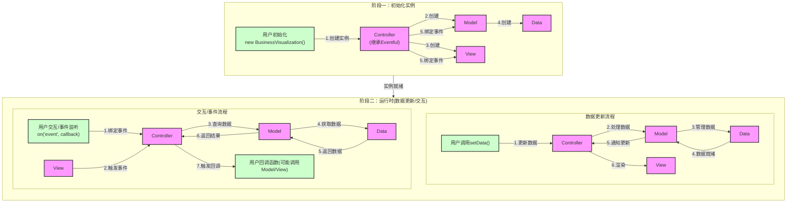

# 业务可视化组件设计文档

> Please DON'T remove notes for AI


> Notes for AI: 以下是框架的项目架构基调
> 根据实际业务设计相关层的业务逻辑实现。可适当调整核心基类， 但必须**非常非常**谨慎思考。

## 1. 项目架构

### 1.1 整体架构
项目采用基于 D3+ ZRender + TypeScript 的组件化架构，基于业务可视化的特点，主要分为以下几个核心模块：

- 主流程模块：负责整体流程控制
- 数据处理模块：负责配置项和业务数据的处理
- 渲染模块：负责调用底层渲染引擎API
- 事件模块：与图表实例对象绑定的事件系统

### 1.2 文件结构
```
components/
├── base/                      # 基础框架核心
│   ├── core/                 # 核心基类
│   │   ├── Eventful.ts     # 事件基类
│   │   ├── Controller.ts    # 控制器类(继承Eventful)
│   │   ├── Model.ts        # 模型类
│   │   ├── View.ts         # 视图类
│   │   └── Data.ts         # 数据处理类
│   │
│   ├── model/                # 模型层业务逻辑实现
│   │
│   ├── view/                # 视图层业务逻辑实现
│   ├── layout/        # 布局计算
│   └── theme/         # 主题系统(可选)
│   │
│   ├── controller/          # 控制器层业务逻辑实现
│   ├── helper/             # 业务相关辅助工具
│   │   ├── functions/     # 辅助函数(可选)
│   │   └── classes/       # 辅助类(可选)
│   │
│   ├── types/              # TypeScript 类型定义
│   │   ├── core.ts        # 核心类型
│   │   ├── model.ts       # 模型相关类型
│   │   ├── view.ts        # 视图相关类型
│   │   └── controller.ts  # 控制器相关类型
│   │
│   └── utils/              # 工具函数
│       ├── math.ts        # 数学计算
│       ├── common.ts      # 通用的工具函数(如isFunction, deepMerge等)
│       └── format.ts      # 格式化工具
│
└── index.ts                # 框架入口文件
```

核心设计说明：
1. **核心基类 (core/)**: 
   - `Eventful`: 提供事件机制的基础类，是整个框架的事件基础
   - `Controller`: 继承自Eventful，作为框架的核心调度者，负责协调其他模块
   - `Model`: 持有Data实例，负责业务数据处理和业务逻辑
   - `View`: 负责视图渲染和用户交互
   - `Data`: 作为Model的内部类，负责数据的存储、处理和管理

2. **业务逻辑实现**:
   - `model/`: 实现具体的业务数据处理逻辑
   - `view/`: 实现具体的视图渲染逻辑
   - `controller/`: 实现具体的业务控制逻辑
   - `layout/`: 实现布局计算逻辑
   - `theme/`: 可选的主题系统实现

3. **辅助工具**:
   - `helper/`: 存放业务相关的辅助工具(可选)
   - `utils/`: 存放通用工具函数，如数学计算、通用函数等
   - `types/`: TypeScript类型定义，确保类型安全

4. **模块职责**:
   - Controller作为核心调度者，负责协调Model和View
   - Model通过内部的Data实例来管理数据
   - View负责渲染和用户交互
   - 各模块通过Controller中继的事件机制通信

5. **设计原则**:
   - 核心基类提供基础能力
   - 业务逻辑在对应目录中实现
   - 通过事件机制实现模块间通信
   - 保持模块间的低耦合度

### 1.3 技术栈选型
- 开发语言：TypeScript
- 构建工具：Rollup
- 可视化计算/布局构件: D3
- 可视化渲染引擎: ZRender或D3
- 包管理器：npm

## 2. 程序流程

> Notes for AI: 以下是框架整体的程序流程基调
> 根据实际业务设计业务逻辑相关模块的内部程序流程。可以调整非业务部分的程序流程，但必须**非常非常**谨慎思考。

### 2.0 整体流程图


### 2.1 初始化阶段
1. **实例创建**
   - 用户创建BusinessVisualization实例
   - Controller实例化
   - Model实例化及其Data实例创建
   - View实例化

2. **事件系统初始化**
   - Controller继承Eventful获得事件能力
   - Controller与Model绑定事件
   - Controller与View绑定事件
   - 事件系统就绪

3. **初始化配置**
   - 配置项校验
   - 默认配置合并
   - 主题初始化(可选)
   - 布局配置初始化

### 2.2 运行时阶段
1. **数据更新流程**
   - 用户调用setData()触发数据更新
   - Controller接收数据并转发给Model
   - Model通过Data进行数据处理
     * 数据格式校验
     * 数据结构转换
     * 数据计算和聚合
   - Data完成处理返回给Model
   - Model通知Controller数据就绪
   - Controller调用View进行渲染

2. **交互事件流程**
   - 用户绑定事件监听(on方法)
   - View触发用户交互事件
   - Controller接收View事件
   - Controller请求Model获取相关数据
   - Model从Data获取数据
   - Controller执行用户回调
   - 用户回调可能触发新的数据更新或视图更新

3. **更新机制**
   - 数据驱动的更新
     * Model数据变更触发更新
     * 批量更新优化
     * 异步更新队列
   - 交互驱动的更新
     * 用户交互触发更新
     * 事件节流和防抖
     * 局部更新优化

4. **资源管理**
   - 数据缓存管理
   - 事件监听管理
   - 内存资源管理
   - 实例销毁处理

## 3. 模块规划

### 3.1 核心模块 (core/)
1. **Eventful**
   - 事件注册机制
   - 事件触发机制
   - 事件解绑机制
   - 事件命名空间管理

2. **Controller**
   - 继承Eventful的事件能力
   - 模块实例管理
   - 事件调度和分发
   - 模块间通信控制
   - 生命周期管理

3. **Model**
   - Data实例管理
   - 业务数据处理
   - 数据状态管理
   - 与Controller通信

4. **View**
   - 渲染引擎管理
   - 视图更新控制
   - 交互事件触发
   - 与Controller通信

5. **Data**
   - 数据存储管理
   - 数据处理转换
   - 数据缓存控制
   - 与Model通信

> Notes for AI: 业务实现层是每次应用框架时设计的重点
> 着重设计业务实现层，以及连带的功能模块、辅助工具
> 着重设计数据管理部分和对外API部分，这决定整个业务板块的核心

### 3.2 业务实现层
1. **模型层实现 (model/)**
   - 具体业务数据处理逻辑
   - 业务规则实现
   - 数据转换规则
   - 数据验证规则

2. **视图层实现 (view/)**
   - 具体视图渲染逻辑
   - 视图组件实现
   - 交互行为实现
   - 动画效果实现

3. **控制层实现 (controller/)**
   - 具体业务流程控制
   - 业务事件处理
   - 状态迁移控制
   - 异常处理机制

### 3.3 功能模块
1. **布局模块 (layout/)**
   - 布局计算引擎
   - 布局策略实现
   - 自适应处理
   - 布局缓存管理

2. **主题模块 (theme/)**(可选)
   - 主题定义和管理
   - 样式规则处理
   - 主题切换机制
   - 样式计算缓存

### 3.4 辅助工具
1. **业务辅助 (helper/)**
   - 业务相关工具函数
   - 业务相关工具类
   - 可选功能扩展
   - 业务常量定义

2. **通用工具 (utils/)**
   - 数学计算工具
   - 通用工具函数
   - 格式化工具
   - 类型判断工具

### 3.5 类型系统 (types/)
1. **核心类型**
   - 基础接口定义
   - 类型别名定义
   - 枚举类型定义

2. **业务类型**
   - 模型相关类型
   - 视图相关类型
   - 控制器相关类型
   - 配置项类型

## 4. 渲染及更新机制

### 4.1 渲染机制
- 渲染引擎API调用策略
- 分层渲染控制
- 按需渲染优化
- 重绘策略优化

### 4.2 更新机制
- 数据驱动更新
- 异步更新队列
- 批量更新优化
- 局部更新策略


## 5. 数据管理

### 5.1 数据结构设计
- 配置项数据结构
- 业务数据结构
- 渲染数据结构
- 缓存数据结构

### 5.2 数据处理流程
- 数据预处理
- 数据转换
- 数据计算
- 数据缓存

## 6. 对外API输出管理

### 6.1 实例API设计
- 图表行为触发方法

### 6.2 实例初始化及更新方法
- 图表实例初始化方法
- 图表数据更新方法